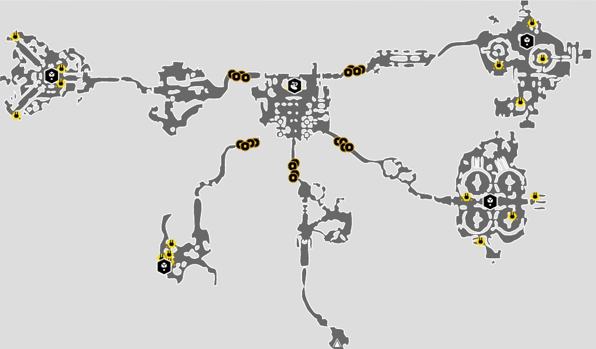

/*
Title: Tuto RAID
Date: 2015/01/01
Template: index
*/

## Tuto RAID

Essayons de mieux comprendre cette épreuve qui necessite de la coordination et de l' organisation.
<h3 align=center>Premiere Partie</h3>
Dans cette premiere partie nous allons devoir ramasser la bombe qui se trouve dans la pièce du milieu(voir carte ci-dessous), et la porter jusqu'aux 4 injecteurs situés aux 4 coins.
Pour ce faire il faudra pirater les consoles au millieu pour que la bombe apparaisse.
Ensuite il faudra faire vite (en effet le porteur de  bombe perd de l'énergie et ne peut pas utiliser ses pouvoirs), il faudra donc lui ouvrir les portes de  maniere à ce qu il ne perde pas de temps.
Une fois dans une des 4 salles d'injecteur il va falloir la aussi faire vite et pirater les 4 consoles afin de rendre l injecteur vulnérable et poser la bombe dessus.
Quand l'injecteur est detruit, on passe au suivant en répetant l'opération. 
<html>

</html>